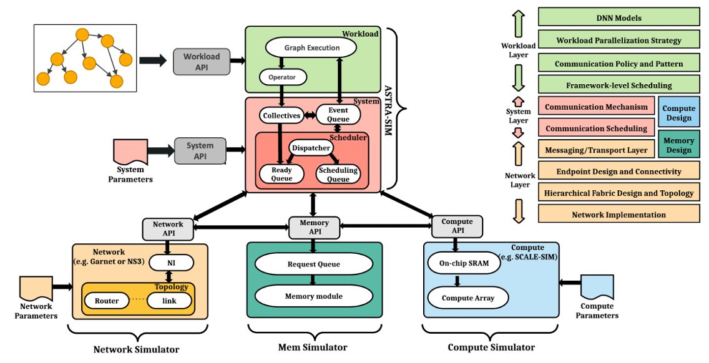
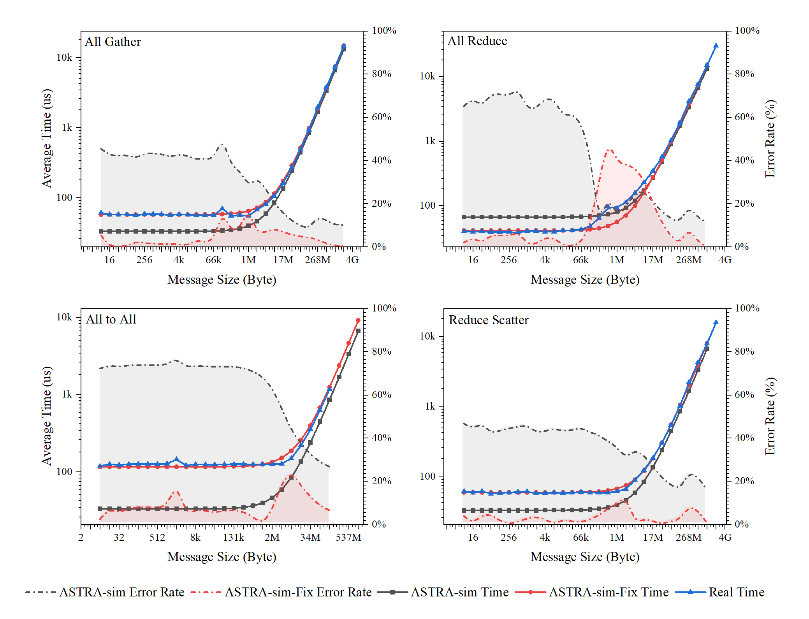
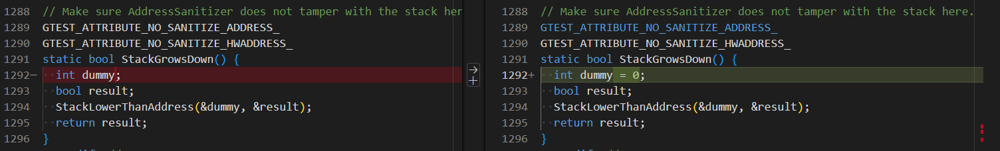

# ASTRA-sim

ASTRA-sim 是一个分布式机器学习系统模拟器。它可以系统地研究现代深度学习系统所面临的挑战，探索瓶颈问题，并为未来不同平台上开发大型 DNN 模型提供高效的方法。

<div align="center">
    
</div>

## 1. 安装过程

### 1.1 安装依赖

- 使用apt安装系统依赖组件

  ```bash
  # 更新apt源
  apt update
  apt upgrade
  # 使用apt安装依赖
  apt install -y gcc g++ make cmake mpich
  apt install -y nano git git-lfs python3 python3-pip
  apt install -y libboost-dev libboost-program-options-dev
  apt install -y libprotobuf-dev protobuf-compiler
  ```

- 安装conda环境**（可选）**

  ```bash
  # 创建conda环境
  conda create -n astra-sim python=3.7 -y
  # 激活conda环境
  conda activate astra-sim
  ```

- 安装python依赖

  ```bash
  # 更新pip工具
  pip install --upgrade pip
  # 安装python组件
  pip install protobuf==3.6.1 pydot -i https://pypi.tuna.tsinghua.edu.cn/simple
  pip install pandas matplotlib seaborn -i https://pypi.tuna.tsinghua.edu.cn/simple
  ```

### 1.2 编译源码

> [!CAUTION]
>
> - 不建议使用较新的Ubuntu系统版本，请使用`gcc -v`检查gcc版本，如果超过gcc-11，后续的工作可能会遇到编译错误！！！
> - 请勿使用root用户编译ASTRA-sim项目，可能会导致ns-3模块编译失败！！！
> - 如果当前正在以root用户登录，请参考`编译失败`章节中的添加普通用户处理过程

#### A. 通过本仓库（推荐）

- 下载astra-sim仓库

  ```bash
  # 使用脚本拉取asplos2023版本的代码
  bash ./clone_astra_sim.sh
  ```

- 如果clone过程中出现网络问题导致遍历clone未完成，可使用如下命令更新子模块

  ```bash
  # 更新子模块
  git submodule update --init --recursive
  ```

- 编译项目

  ```bash
  # 使用Analytical Network作为后端编译
  bash ./build_analytical.sh
  # 使用阻塞的Analytical作为后端编译
  bash ./build_congestion.sh
  ```

#### B. 通过ASTRA-sim

- 下载源码**（需要提前在github上配置ssh密钥）**

  ```bash
  # clone源码仓库以及其相关的依赖仓库
  git clone --recurse-submodules git@github.com:astra-sim/astra-sim.git
  ```

- 编译源码

  ```bash
  # 切换到源码仓库的文件夹
  cd astra-sim
  # 使用Analytical Network作为后端编译
  bash ./build/astra_analytical/build.sh
  # 使用NS3 Network Backend作为后端编译
  bash ./build/astra_ns3/build.sh -c
  ```

- ASTRA-sim 生成后，可执行文件 `${BINARY}` 位于：

  ```bash
  # 当使用Analytical Network作为后端编译时
  ${ASTRA_SIM}/build/astra_analytical/build/AnalyticalAstra/bin/AnalyticalAstra
  ```

## 2. 仿真验证

### 2.1 仿真参数解释

在使用ASTRA-sim进行仿真之前需要对网络的以及算法相关的参数进行定义。

#### A. 网络参数

- https://astra-sim.github.io/astra-network-analytical-docs/input-format/input-format.html
- https://astra-sim.github.io/astra-sim-docs/getting-started/argument-network-config.html

```json
{
  "dimensions-count": 1,
  "topologies-per-dim": ["FullyConnected"],
  "units-count": [8],
  "links-count": [7],
  "link-latency": [22000],
  "link-bandwidth": [20]
}
```

- **dimensions-count** 维度是数量，这里以8个Ascend组成的全连接网络为例，维度为1
- **topologies-per-dim** 每个维度的拓扑结构，可选：`FullyConnected`、`Ring`、`Swicth`等
- **units-count** 每个维度待组网的节点数量
- **links-count** 每个节点的链接数量
- **link-latency** 链接的延迟，单位ns
- **link-bandwidth** 链接的单向带宽，单位GB/s

#### B. 系统参数

- https://astra-sim.github.io/astra-sim-docs/getting-started/argument-system-config.html

```yml
scheduling-policy: LIFO
endpoint-delay: 10
active-chunks-per-dimension: 8
preferred-dataset-splits: 8
boost-mode: 1
all-reduce-implementation: direct
all-gather-implementation: direct
reduce-scatter-implementation: direct
all-to-all-implementation: direct
collective-optimization: localBWAware
```

- **scheduling-policy** 调度策略
- **endpoint-delay** 每个节点的延迟，单位是始终周期（默认时钟为1GHz，这里的单位可以视为ns）
- **active-chunks-per-dimension** 每个维度激活的块
- **preferred-dataset-splits** 数据集对象拆分的块数量
- **boost-mode** 当使用对称网络时进行快速仿真
- **all-reduce-implementation** AllReduce的实现方法，例如：`ring`、`direct`、`doubleBinaryTree`、`oneRing`、`oneDirect`.等
- **collective-optimization** 集合通信优化策略

#### C. 负载参数

- **注意版本，以下链接仅适用于最新版本的workload参数生成**
  - https://astra-sim.github.io/astra-sim-docs/getting-started/argument-workload-config.html

- **以下Youtube视频适用于本仓库的workload参数设置**
  - https://youtu.be/AVtqhMV1UOU?si=AJBpo-q7Ve8K411I


```txt
MICRO
1
allreduce -1 1 NONE 0 1 NONE 0 1 ALLREDUCE 2147483648 1
```

- **Line 1：MICRO** 训练的loop
- **Line 2：1** 层号
- **Line 3：allreduce** `<元数据>` 层的名字
- **Line 3：-1** `<元数据> ` 保留参数
- **Line 3：1** `<前向传播>` 计算时间，单位us
- **Line 3：NONE** `<前向传播>` 通信类型
- **Line 3：0** `<前向传播>`通信数据量大小，单位Byte
- **Line 3：1** `<输入梯度>` 计算时间，单位us
- **Line 3：None** `<输入梯度>` 通信类型
- **Line 3：0** `<输入梯度>` 通信数据量大小，单位Byte
- **Line 3：1** `<权重梯度>` 计算时间，单位us
- **Line 3：ALLREDUCE** `<权重梯度>` 通信类型
- **Line 3：2147483648** `<权重梯度>` 通信数据量大小，单位Byte
- **Line 3：1** `网络层` 延迟

### 2.2 仿真参数获取

在进行仿真实验时，正确的对仿真参数进行设置将会对实验结果产生至关重要的影响，但是仿真参数的获取需要通过实际物理参数和实测数据获取。

#### 2.2.1 链路延迟

使用P2P单向通信发送一个很小的数据包（8Byte），由于通信带宽较高，且在端处未进行任何耗时的运算，因此可以认为该时间为实际的链路延迟时间。

- 在实际测试中，使用`NPU0`向`NPU1`发送8Byte数据，重复20次，平均每次耗时约$33.254 \mu s$
- 在仿真实验中，将链路延迟参数设置为$33.254 \mu s$​

#### 2.2.2 链路带宽

使用P2P单向发送一个很大的数据包（1GByte），由于链路延迟很小，且在端出未进行任何耗时的运算，因此可以认为该测试带宽为实际的链路带宽。

- 在实际测试中，使用`NPU0`向`NPU1`发送1GByte数据，重复20次，平均每次耗时约$52886.56 \mu s$
- 在仿真实验中，将链路带宽的参数设置为$1 G Byte / 52886.56 \mu s=18.908GB/s$​

#### 2.2.3 修正的链路带宽

由于在进行集合通信时可能存在计算、内存复制等操作，在集合通信时的数据带宽可能无法达到理论的链路带宽值，因此使用实测的集合通信数据作为修正的链路带宽

- **allgather** 7条链路，单向传输1792MB，平均耗时$14754.66 \mu s$，则修正的链路带宽为$16.944 GB/s$​

- **allreduce** 7条链路，单向传输3584MB，平均耗时$29993.87 \mu s$，则修正的链路带宽为$16.67 GB/s$

- **alltoall** 7条链路，单向传输1792MB，平均耗时$17763.6 \mu s$，则修正的链路带宽为$13.812 GB/s$

- **reducescatter** 7条链路，单向传输1792MB，平均耗时$15802.01 \mu s$，则修正的链路带宽为$15.821 GB/s$

#### 2.2.4 系统延迟

在进行简单的集合通信操作时，如果进行集合通信的数据量很小（8Byte ~ 64kByte），由于通信带宽较高，可以认为数据传输时间为0，则此时迭代消耗的时间为链路延迟与系统延迟之和，其中链路延迟已暂定为$33.254 \mu s$

- **allgather** 在集合通信的数据量很小时，平均耗时为$57.764 \mu s$
- **allreduce** 在集合通信的数据量很小时，平均耗时为$41.056 \mu s/2=20.528 \mu s$（每条链路发生两次传输）
- **alltoall** 在集合通信的数据量很小时，平均耗时为$116.886 \mu s$
- **reducescatter** 在集合通信的数据量很小时，平均耗时为$59.929 \mu s$​

> 在实验过程中，由于使用修正的链路带宽，因此已经把不同算法的系统延迟参数带入了修正的链路带宽参数，因此只需要将以上测试结果视为链路延迟即可

#### 2.2.5 其他参数

其他参数，例如通信集合算法、优化算法、调度策略、网络拓扑等根据实际数据设定

- 拓扑结构为8个NPU组成的一维网络，全链接网络拓扑
- 集合通信算法选择 `direct`
- 集合通信优化算法选择 `baseline`
- 其他参数设置参考 `ascend_910b/inputs/` 文件夹

### 2.3 仿真结果

- **灰色曲线** 为使用未修正的参数进行仿真的结果
- **红色曲线** 为使用修正后的参数进行方正的结果
- **蓝色曲线** 为使用Ascend 910B实测的实验数据



## 常见问题处理

### 编译失败

- **extern/…/gtest-death-test.cc:1294:24: error: ‘dummy’ may be used uninitialized…**

  打开文件`astra-sim/extern/googletest/googletest/src/gtest-death-test.cc`找到第`1294`行，发现这里的函数调用之前只做了声明，未进行赋值，给参数`dump`一个默认值`0`即可

  

- **extern/…/ChunkIdGenerator.hh:16:23: error: ‘uint64_t’ does not name a type…**

  打开文件`astra-sim/extern/network_backend/analytical/congestion/api/ChunkIdGenerator.hh`并在文件的第11行添加`#include <cstdint>`

  

- **extern/…/et_def.pb.h:17:2: error: #error This file was generated by an older…**

  一般是protoc工具的版本问题，如果使用的是Anaconda环境，需要检查环境是否正确，如果不正确的话，请使用`conda avtivate astra-sim`激活已经配置好的Anaconda环境
  
- **Exception: Refusing to run as root. --enable-sudo will request your password when needed**

  一般是因为使用了root用户进行编译操作导致的，请勿使用root用户登录并编译该文件，请切换为普通用户后尝试

  - 可以使用`adduser astrasim`创建普通用户
  - 然后使用`su astrasim`切换到普通用户后执行

  使用普通用户编译完成后记得需要使用`cp -r <src_path> <dst_path>`命令复制编译后的产物到指定路径，然后使用`chown -R root <dst_path>`修改文件夹的权限

### 运行失败

- **AnalyticalAstra: /…libstdc++.so.6: version `GLIBCXX_3.4.32' not found…**

  使用`strings xxx/anaconda3/lib/libstdc++.so.6 | grep GLIBCXX`发现输出的GLIBC版本中缺少指定的3.4.32版本的标记，通过`find /usr -name libstdc++.so.6`搜索其他`libstdc++.so.6`文件所在的位置，并使用如下命令将其导入动态链接库环境变量中即可

  ```bash
  # 如有必要，可以将以下内容添加至~/.bashrc文件中
  export LD_LIBRARY_PATH=/usr/lib/x86_64-linux-gnu:$LD_LIBRARY_PATH
  ```

