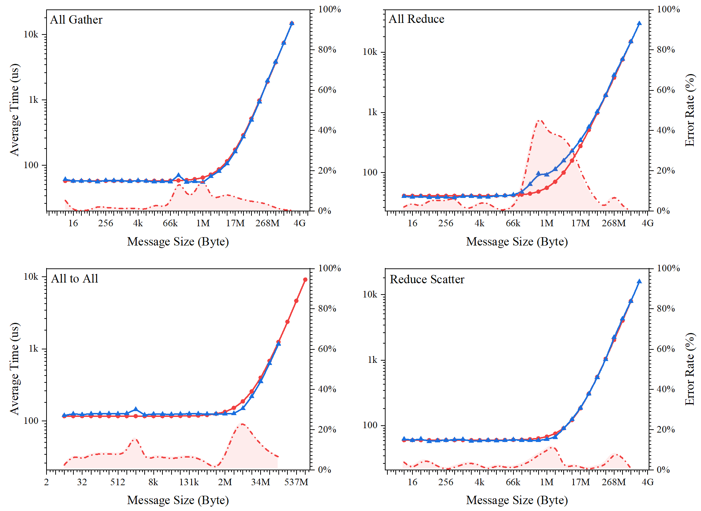

# ASTRA-sim

**源码细节正在调试，暂未开放，欢迎邮件沟通 [zzudongxiang@163.com](mailto:zzudongxiang@163.com)**

**源码细节正在调试，暂未开放，欢迎邮件沟通 [zzudongxiang@163.com](mailto:zzudongxiang@163.com)**

**源码细节正在调试，暂未开放，欢迎邮件沟通 [zzudongxiang@163.com](mailto:zzudongxiang@163.com)**

ASTRA-sim 是一个分布式机器学习系统模拟器。它可以系统地研究现代深度学习系统所面临的挑战，探索瓶颈问题，并为未来不同平台上开发大型 DNN 模型提供高效的方法。

## 1. 快速开始

- **项目的[安装](./docs/INSATLL.md)、[使用](./docs/MANUAL.md)、[帮助](./docs/HELP.md)等功能请参考[docs](./docs)文件夹中的说明文件**
  - **[INSTALL.md](./docs/INSTALL.md)** 项目的安装教程和安装指导，指示如何正确的构建所需的工具链
  - **[MANUAL.md](./docs/MANUAL.md)** 项目的使用帮助手册，指示如何使用本仓库进行ASTRA-sim仿真
  - **[HELP.md](./docs/HELP.md)** 关于项目开发过程中的一些帮助信息，包括参数解释、参数获取方法等

## 2. 仿真效果

### 2.1 Ascend910B 集合通信效果

在华为Ascend 910B设备上进行8个NPU的集合通信仿真结果对比如下

- **红色曲线** 为使用ASTRA-sim仿真的结果
- **蓝色曲线** 为使用Ascend 910B实测的实验数据

