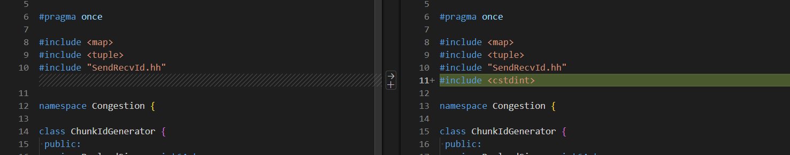

# ASTRA-sim

ASTRA-sim 是一个分布式机器学习系统模拟器。它可以系统地研究现代深度学习系统所面临的挑战，探索瓶颈问题，并为未来不同平台上开发大型 DNN 模型提供高效的方法。


## 1. 安装过程

### 1.1 安装依赖

- 使用apt安装系统依赖组件

```bash
# 更新apt源
apt update
# 使用apt安装依赖
apt install -y gcc g++ make cmake libboost-dev libboost-program-options-dev libprotobuf-dev protobuf-compiler python3 python3-pip git git-lfs nano
```

- 安装conda环境（可选）

```bash
# 创建conda环境
conda create -n astra-sim python=3.7 -y
# 激活conda环境
conda activate astra-sim
```

- 安装python依赖

```bash
# 更新pip工具
pip install --upgrade pip
# 安装python组件
pip install protobuf==3.6.1 pydot pandas matplotlib seaborn
```

### 1.2 编译源码

> **不建议使用较新的Ubuntu系统版本，请注意检查gcc的版本，如果超过gcc-11，后续的工作可能会遇到编译错误！！！**

#### A. 通过Tutorials（推荐）

- 下载Tutorials源码

```bash
# clone tutorials仓库
git clone https://github.com/astra-sim/tutorials.git
```

- 执行clone命令（需要提前在github上配置好ssh密钥）

```bash
# 切换到asplos2023文件夹
cd tutorials/asplos2023
# 执行clone命令
bash ./clone_astra_sim.sh
```

- 编译工程

```bash
# 使用Analytical Network作为后端编译
bash ./build_analytical.sh
# 使用阻塞的Analytical作为后端编译
bash ./build_congestion.sh
```

- 验证结果

```bash
# 运行case 1-1
bash ./exercise_1/exercise_1-1.sh
```

#### B. 通过ASTRA-sim

- 下载源码（需要提前在github上配置好ssh密钥）

```bash
# clone源码仓库以及其相关的依赖仓库
git clone --recurse-submodules git@github.com:astra-sim/astra-sim.git
```

- 编译源码

```bash
# 切换到源码仓库的文件夹
cd astra-sim
# 使用Analytical Network作为后端编译
bash ./build/astra_analytical/build.sh
# 使用NS3 Network Backend作为后端编译
bash ./build/astra_ns3/build.sh -c
```

### 1.3 运行ASTRA-sim

- ASTRA-sim 生成后，可执行文件 `${BINARY}` 位于：

```bash
# 当使用Analytical Network作为后端编译时
${ASTRA_SIM}/build/astra_analytical/build/AnalyticalAstra/bin/AnalyticalAstra
```

- 通过传递所需的参数来运行模拟：

```bash
${BINARY} \
  --workload-configuration=${WORKLOAD_CONFIG} \
  --system-configuration=${SYSTEM_CONFIG} \
  --network-configuration=${NETWORK_CONFIG} \
  --remote-memory-configuration=${REMOTE_MEMORY_CONFIG}
```

## 常见问题处理

### 编译失败

- **extern/…/gtest-death-test.cc:1294:24: error: ‘dummy’ may be used uninitialized…**

  打开文件`astra-sim/extern/googletest/googletest/src/gtest-death-test.cc`找到第`1294`行，发现这里的函数调用之前只做了声明，未进行赋值，给参数`dump`一个默认值`0`即可

  

- **extern/…/ChunkIdGenerator.hh:16:23: error: ‘uint64_t’ does not name a type…**

  打开文件`astra-sim/extern/network_backend/analytical/congestion/api/ChunkIdGenerator.hh`并在文件的第11行添加`#include <cstdint>`

  

- **AnalyticalAstra: /…libstdc++.so.6: version `GLIBCXX_3.4.32' not found…**

  使用`strings xxx/anaconda3/lib/libstdc++.so.6 | grep GLIBCXX`发现输出的GLIBC版本中缺少指定的3.4.32版本的标记，通过`find /usr -name libstdc++.so.6`搜索其他`libstdc++.so.6`文件所在的位置，并使用如下命令将其导入动态链接库环境变量中即可

  ```bash
  # 如有必要，可以将以下内容添加至~/.bashrc文件中
  export LD_LIBRARY_PATH=/usr/lib/x86_64-linux-gnu:$LD_LIBRARY_PATH
  ```

- **extern/…/et_def.pb.h:17:2: error: #error This file was generated by an older…**

  如果使用的是Anaconda环境，需要检查环境是否正确，如果不正确的话，请使用`conda avtivate astra-sim`激活已经配置好的Anaconda环境

  

  

  

